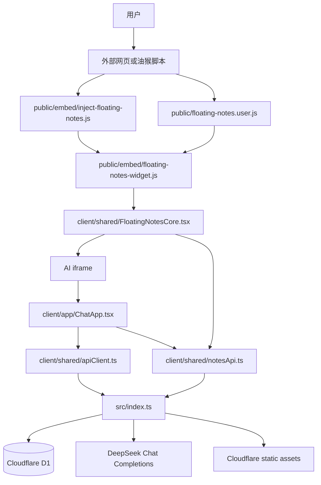
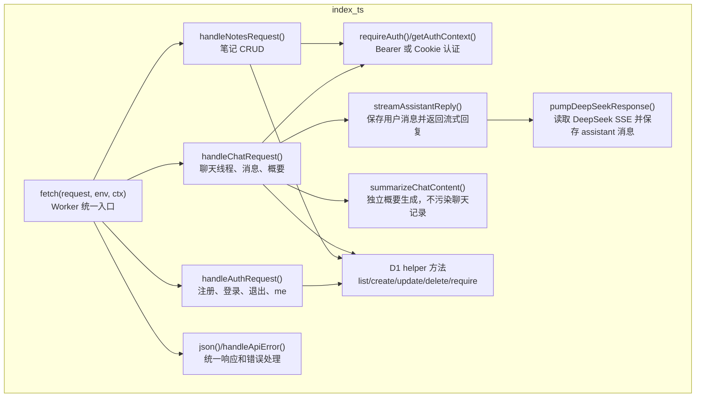
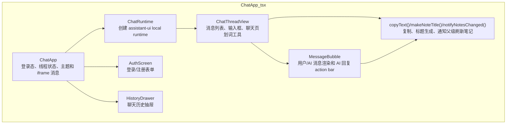
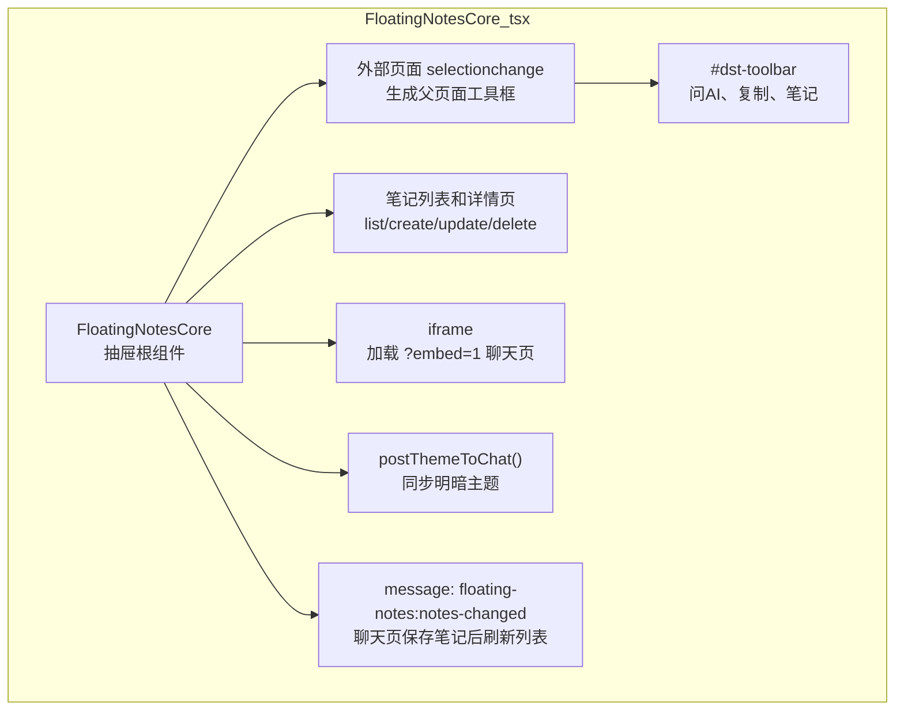
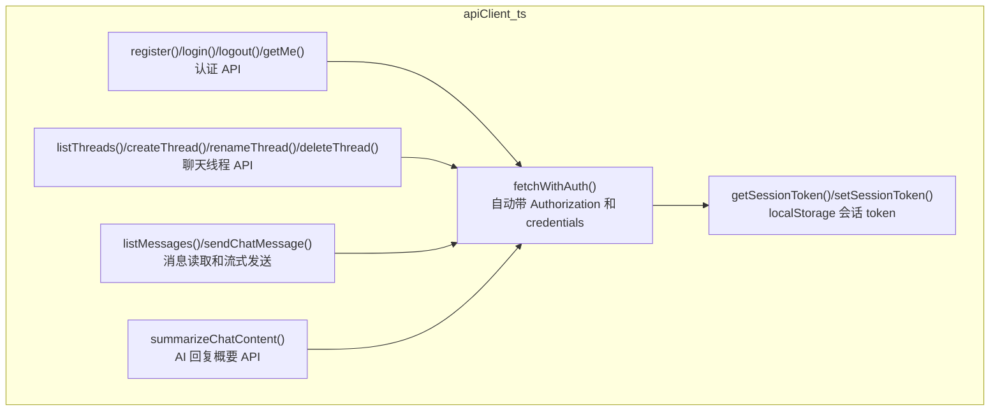
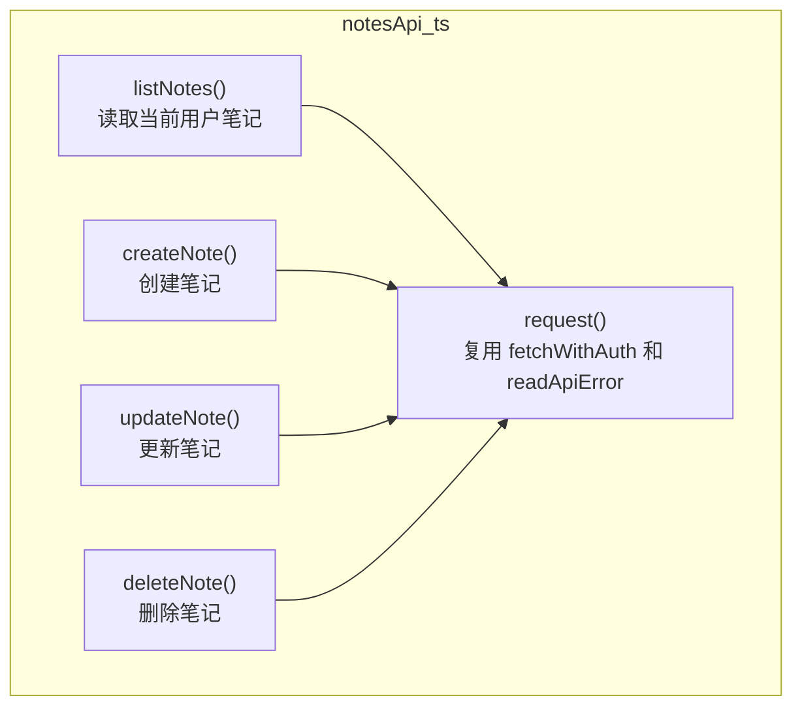
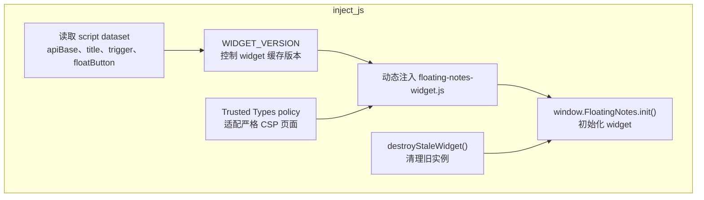
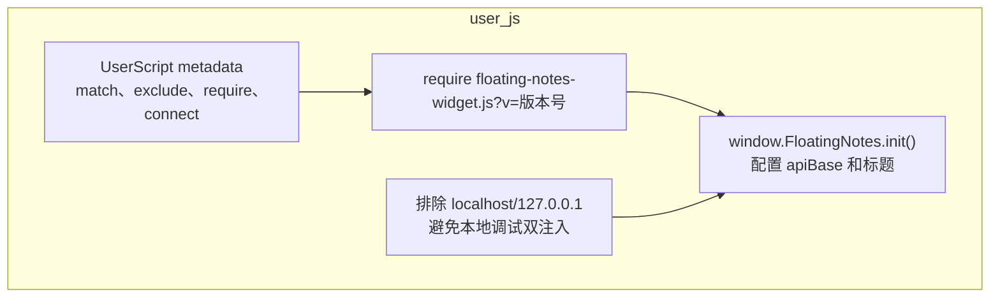
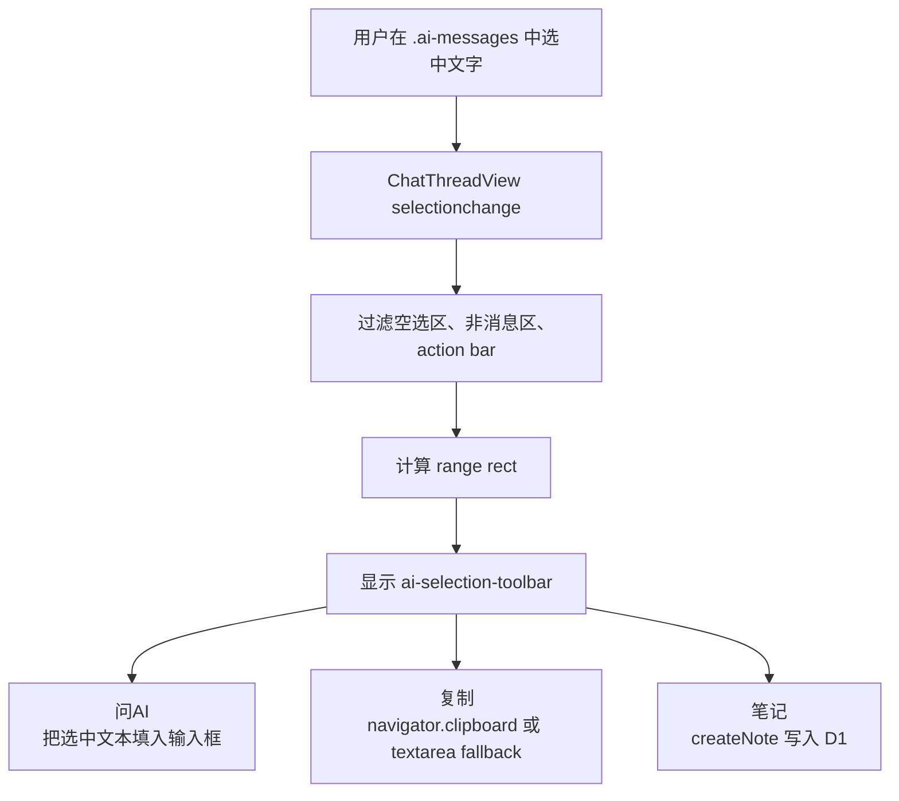
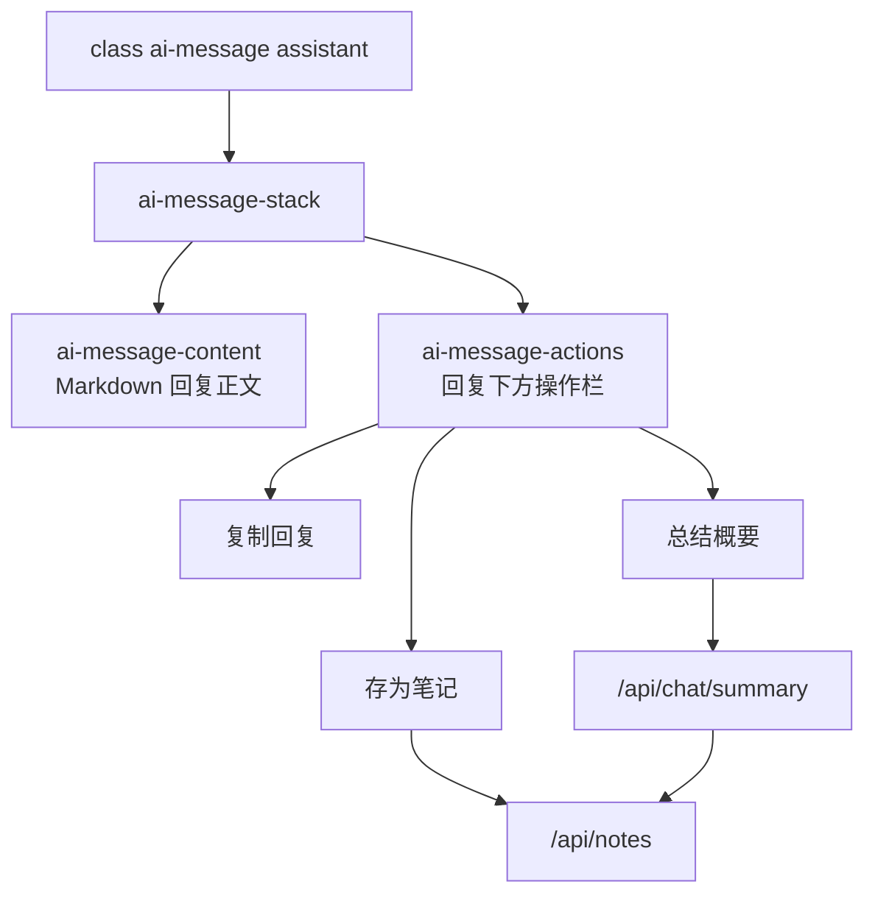

# 悬浮笔记本 y

> 模块功能描述：该工程是部署在 Cloudflare Workers 上的悬浮笔记本和 AI 聊天应用。主站使用 React，后端 Worker 提供认证、D1 笔记、D1 聊天线程和 DeepSeek 流式代理接口；嵌入脚本和油猴脚本复用构建后的 React widget。当前优化目标集中在 AI 聊天页：支持聊天内容划词工具框，并在 AI 回复下方增加复制、存为笔记、总结概要并存为笔记的操作栏。

## 一.文件目录

### 整体结构概览

```text
y/
├── src/
│   └── index.ts                         【入口】【核心】Cloudflare Worker 后端，处理认证、笔记、聊天、DeepSeek 代理
├── client/
│   ├── main.tsx                         【入口】主站 React 入口
│   ├── app/
│   │   ├── App.tsx                      【入口】主站页面容器
│   │   └── ChatApp.tsx                  【核心】AI 聊天页、登录、线程历史、消息渲染、聊天页内划词与回复操作
│   ├── shared/
│   │   ├── FloatingNotesCore.tsx        【核心】悬浮抽屉、外部页面划词工具、笔记列表、AI iframe 承载
│   │   ├── apiClient.ts                 【核心】认证和聊天 API 客户端
│   │   ├── notesApi.ts                  【核心】笔记 API 客户端
│   │   ├── floatingNotes.css            【核心】主站、聊天页、widget 共用样式
│   │   └── types.ts                     【数据模型】Note、DraftNote、SelectionToolbar 等类型
│   └── widget/
│       └── entry.tsx                    【入口】嵌入式 widget React 入口
├── public/
│   ├── embed/
│   │   ├── floating-notes-widget.js     【构建产物】外部网页和油猴脚本加载的 widget
│   │   └── inject-floating-notes.js     【入口】普通网页一行嵌入加载器
│   ├── floating-notes.user.js           【入口】Tampermonkey 油猴脚本安装文件
│   └── *.svg                            【资源】按钮图标和静态资源
├── migrations/
│   ├── 0001_create_notes.sql            【数据模型】notes 表
│   ├── 0002_chat_auth.sql               【数据模型】认证和聊天表历史迁移
│   └── 0003_auth_chat_tables.sql        【数据模型】当前认证、聊天线程、消息表
├── test/
│   └── miniflare.spec.ts                【测试】Worker、D1、静态资源和 DeepSeek 流式接口测试
├── wrangler.jsonc                       【配置】Worker、D1、静态资源、run_worker_first
├── vite.config.mts                      【配置】主站和 Worker 构建
├── vite.widget.config.mts               【配置】widget 构建
└── package.json                         【配置】脚本和依赖
```

### 主要文件的依赖关系

以下为核心链路：外部页面或主站进入 `FloatingNotesCore`，聊天页由 iframe 加载 `ChatApp`，两者共用认证 token 和笔记 API，Worker 负责 D1 与 DeepSeek 调用。



> 说明：
>
> - `FloatingNotesCore.tsx` 负责抽屉、外部页面划词工具、笔记列表和 AI iframe。
> - `ChatApp.tsx` 运行在 iframe 内，负责登录态、线程历史、消息渲染和聊天页内部交互。
> - 外部页面的 `selectionchange` 捕获不到 iframe 内的选区，所以 AI 聊天页文字选中必须在 `ChatApp.tsx` 内单独实现。
> - `/api/notes` 和 `/api/chat/*` 都由 `src/index.ts` 先于静态资源处理；其他路径交给 Cloudflare static assets。

## 二.具体文件分析

### src/index.ts（Worker 后端入口）

路径：`src/index.ts`



> 重点：
>
> - `/api/auth/*`：维护用户、会话 token 和 Cookie。
> - `/api/notes`：按登录用户隔离笔记。
> - `/api/chat/threads`：线程列表、创建、重命名、归档。
> - `/api/chat/threads/:id/messages`：保存用户消息，调用 DeepSeek 流式接口，落库 assistant 回复。
> - `/api/chat/summary`：本次新增的独立概要接口，只返回概要文本，不写入聊天消息表，避免 action bar 的内部提示污染聊天历史。

### client/app/ChatApp.tsx（AI 聊天页）

路径：`client/app/ChatApp.tsx`



> 重点：
>
> - `ChatApp` 初始化用户、线程和历史消息。
> - `chatModel.run()` 通过 `sendChatMessage()` 走 Worker 的流式聊天接口。
> - `ChatThreadView` 本次新增 iframe 内 `selectionchange` 监听：只接受 `.ai-messages` 内文字选区，显示 `问AI / 复制 / 笔记` 工具框。
> - `MessageBubble` 本次新增 AI 回复 action bar：复制回复、存为笔记、总结概要。
> - `notifyNotesChanged()` 用 `postMessage` 通知父级 `FloatingNotesCore` 刷新笔记列表和角标。

### client/shared/FloatingNotesCore.tsx（悬浮抽屉和外部划词）

路径：`client/shared/FloatingNotesCore.tsx`



> 重点：
>
> - 这里保留外部网页划词工具，不承担 iframe 内聊天页划词。
> - `postSelectionToChat()` 把外部选中文字发送给 iframe 内 `ChatApp`。
> - 本次新增对 `floating-notes:notes-changed` 的监听，让聊天页内保存笔记后父抽屉能刷新笔记列表。

### client/shared/apiClient.ts（认证和聊天 API 客户端）

路径：`client/shared/apiClient.ts`



> 重点：
>
> - `fetchWithAuth()` 是所有登录态 API 的统一入口。
> - 本次新增 `summarizeChatContent()`，对应 Worker 的 `/api/chat/summary`。

### client/shared/notesApi.ts（笔记 API 客户端）

路径：`client/shared/notesApi.ts`



> 重点：
>
> - AI 回复“存为笔记”和“总结概要”最终都落到 `createNote()`。
> - 登录态由 `apiClient.ts` 统一注入，不在笔记 API 内重复处理。

### public/embed/inject-floating-notes.js（网页嵌入入口）

路径：`public/embed/inject-floating-notes.js`



> 重点：
>
> - 普通网页只需要加载这个入口。
> - 实际交互逻辑在构建产物 `floating-notes-widget.js`。

### public/floating-notes.user.js（油猴脚本入口）

路径：`public/floating-notes.user.js`



> 重点：
>
> - 油猴脚本直接 `@require` widget，不通过 `inject-floating-notes.js`。
> - widget 更新后需要同步 `@version` 和 `@require ?v=`。

## 三.本次优化方案

### 1. AI 聊天页文字划词工具框

落点：`client/app/ChatApp.tsx`



> 原因：AI 聊天在 iframe 内，父页面无法稳定拿到 iframe 的选区；所以聊天页必须自己监听 `selectionchange`。

### 2. AI 回复 action bar

落点：`client/app/ChatApp.tsx`、`client/shared/floatingNotes.css`



> 设计取舍：
>
> - “复制回复”只处理当前 AI 回复全文。
> - “存为笔记”保存当前 AI 回复全文。
> - “总结概要”调用独立 summary 接口拿到概要后再保存为笔记。
> - summary 不写入聊天消息表，避免聊天历史出现系统内部提示。

## 四.demo

### 业务方调用示例

普通网页嵌入：

```html
<script
  src="https://notes.edmund.xin/embed/inject-floating-notes.js"
  data-api-base="https://notes.edmund.xin"
  data-title="笔记">
</script>
```

聊天页本次新增交互：

```text
1. 打开悬浮抽屉，进入 DeepSeek 智聊。
2. 在 AI 聊天消息区选中文字。
3. 出现工具框：问AI、复制、笔记。
4. 在 AI 回复下方点击：复制回复、存为笔记、总结概要。
5. 存为笔记或概要保存后，父抽屉收到 floating-notes:notes-changed 并刷新笔记列表。
```

### 运行

开发：

```bash
npm run dev
```

类型检查：

```bash
npm run typecheck
```

生产构建：

```bash
npm run build
```

完整测试：

```bash
set -a
. /private/tmp/y-deepseek.env
set +a
npm test
```

### 已验证

```text
npm run typecheck 通过
npm run build 通过
npm test 通过，8 个测试全部通过
```
